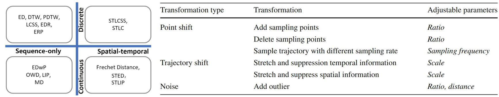

# A survey of trajectory distance measures and performance evaluation

The Java implementation of the following paper:
- Han Su, Shuncheng Liu, Bolong Zheng, Xiaofang Zhou, Kai Zheng*: [A Survey of Trajectory Distance Measures and Performance Evaluation](https://leoshuncheng.github.io/pap/vldbj_2020_su.pdf). VLDBJ 2020

The implementation mainly contains 15 trajectory distance measures and 7 trajectory transformations.

## Requirement
- System: Windows/Linux/macOS
- Language: Java 1.8

## Run
- src/team/dig/vtdm/services/Main.java

## Input
A subset of [Geolife](https://www.microsoft.com/en-us/research/publication/geolife-gps-trajectory-dataset-user-guide/) dataset.
- src/data/input/Geolife Trajectories TEST/


## Output
The trajectory distances calculated by all trajectory distance measures (with or without 7 trajectory transformations).
- src/data/output/

## Citation
If you find this repository useful in your research, please at least cite the following paper:


- Han Su, Shuncheng Liu, Bolong Zheng, Xiaofang Zhou, Kai Zheng*: [A Survey of Trajectory Distance Measures and Performance Evaluation](https://leoshuncheng.github.io/pap/vldbj_2020_su.pdf). VLDBJ 2020


```
@article{su2020survey,
  title={A survey of trajectory distance measures and performance evaluation},
  author={Su, Han and Liu, Shuncheng and Zheng, Bolong and Zhou, Xiaofang and Zheng, Kai},
  journal={The VLDB Journal},
  volume={29},
  number={1},
  pages={3--32},
  year={2020},
  publisher={Springer}
}
```

If you use Geolife dataset, please check the citation terms on the [official website](https://www.microsoft.com/en-us/research/publication/geolife-gps-trajectory-dataset-user-guide/).
